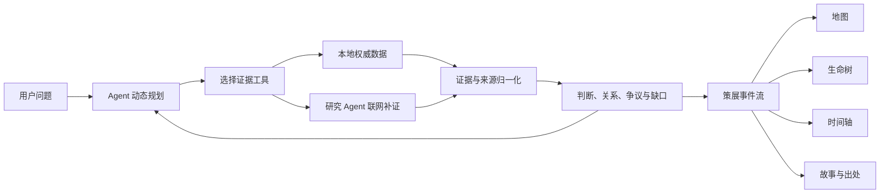

# 光锥之内 · Inside the Light Cone

**让 Agent 沿证据生长故事。**

“光锥之内”是一套历史与数字人文策展 Agent。它围绕人物、家族、族群、遗址、考古发现和古代人群，自主建立调查边界、生成问题树、编排数据源与工具、追踪事实和观点、识别冲突与空白，并把不断增长的证据组织成可验证、可交互、可继续推演的历史世界。

## 项目缘起

历史研究中的证据分散在古基因组数据、考古发掘报告、正史与编年材料、地方志、作品集、善本书、可信回忆录、论文、机构数据库和博物馆目录中。传统检索界面常以文献列表结束，研究者仍需手工拼接人物、地点、年代、迁徙、关系与影响。

本项目把这些材料组织成可计算的证据网络。每条材料保留来源、时间精度、地点精度、证据层级和引用关系；Agent 根据用户当下的问题决定调查方向，并将证据转换为可交互的时空叙事。

## 展示方式

以苏轼为例，Agent 可以围绕迁徙、任职、贬谪、作品、思想与后世影响形成动态主线：

- 地图显示有来源支持的地点与真实位移，拖动时间轴即可观察一生轨迹；
- 生命树的枝条来自本轮调查计划，叶子对应关键事件与故事；
- 时间轴、地图、生命树和故事卡共享同一事件 ID，选择任一视图都会同步定位；
- 每片叶子可回到史传、方志、作品集、论文或数据库记录；
- 争议观点、证据缺口和后世影响可以沿独立分支继续生长。

换成建州女真、爱新觉罗家族、历史战役、考古遗址或古代人群，系统沿用同一套调查协议，由 Agent 重新规划主题枝、证据来源和叙事结构。

## Agent 如何工作

Agent 每轮根据已取得的证据决定下一步动作。计划、工具调用、判断更新、来源补证和策展节点都通过统一协议进入事件流。



它的自主性体现在五个环节：

1. 根据问题生成 4–8 条调查主线；
2. 依据证据状态选择本地检索、古基因组、考古、地名、文献或联网研究工具；
3. 将新证据与既有判断连接，更新支持、反驳、亲缘、同址、同时和派生关系；
4. 识别材料冲突、时间地点精度和证据空白；
5. 按当前问题生成策展节点与主题枝，同一批材料可以形成不同叙事。

前端只消费 Agent 生成的通用事件协议。任何人物、家族、族群或遗址都能进入相同链路，策展结果由问题与证据共同决定。

## 证据体系

系统已经接入 AADR v66.p1 古基因组公开数据制品，并建立文献、人物、遗址、时间和外部标识的本地索引。核心数据字段包括：

- 实体：人物、家族、族群、遗址、机构、作品与事件；
- 时间：起止年份、原始纪年文字与时间精度；
- 空间：历史地名、现代地名、经纬度与地点精度；
- 来源：史传、方志、作品集、善本、回忆录、论文、发掘报告、古基因组数据集、机构数据库与馆藏目录；
- 判断：事实、研究观点、争议状态与证据缺口；
- 关系：支持、反驳、亲缘、同址、同时、组成与派生。

地图采用矢量中国标准轮廓图，事件点、迁徙线与时间轴保持同步；只有证据明确支持位移时才生成路线。

## 本地策展主题与调查历史

系统优先检索本地策展主题包、AADR 古基因组目录和既有研究成果。本地材料不足时，研究 Agent 才按证据缺口联网补证。主题包保存来源、引文、年代、地点和证据层级；调查计划、判断关系、生命树和策展叙事仍由 Agent 根据用户问题现场生成。

当前预载两个演示主题：苏轼生平迁徙、作品与影响；客家人的迁徙、古基因组与现代分子人类学与考古等多尺度证据。后者把历史文献、语言边界、聚落建筑、区域古基因组与现代群体遗传研究放进同一证据空间，并保留史前区域样本与历史时期客家身份之间的证据边界。

每次调查的事件流和当前状态都会写入 SQLite。浏览器刷新或后端重启后，检索历史仍可恢复并继续回看；新调查不会覆盖旧调查。历史菜单支持逐条删除，并同步清除该调查的事件、判断和关系记录。

调查完成后，后端会把动态主线、判断、策展节点和去重证据整理为结构化调查报告。页面底部可在“专业版”和“科普版”之间切换：专业版保留证据等级、研究判断和完整来源目录，科普版按策展故事节点组织文字并单列尚待确认的证据边界。

## 当前版本进展

当前版本已通过中期审查，并完成前端展示与端到端调查链路的大幅更新。整体界面采用星空蓝与橙金配色；地图使用中国标准轮廓矢量图；地图、生命树、故事卡和可拖动时间轴共享同一批策展事件；迁徙事件按时间进度绘制连续路线；调查历史可以跨刷新、跨后端重启恢复；页面底部可以生成面向历史文博学者的专业报告和面向博物馆观众的科普报告。苏轼与客家主题包已经接入本地优先、缺口联网补证的统一 Agent 调查流程。

公众输入门禁已升级为本地确定性拦截与轻量语义分类的组合：输入先经过 Unicode、零宽字符和空格混淆归一化，再检查指令攻击、虚构前提、角色扮演、领域外操作和异常长度；其余问题由无工具权限的分类模型判断领域、对象类型、证据可核验性与上下文连续性。门禁只接受结构化分类结果，低置信度、分类服务异常和输出格式错误都会闭门返回 422。被拒绝的问题不创建调查记录，也不触发调查 Agent 与联网检索。

## 数字人文策展场景

系统可以围绕历史人物重建生平迁徙、仕宦、作品、思想与后世影响；围绕家族和王朝展开谱系、政治关系、战争与制度变迁；围绕古代族群连接史书记载、考古文化、墓地网络和古基因组证据；围绕遗址组织发掘层位、器物、测年、个体关系和学术争议。调查中新出现的人物、地点、材料和假说都能成为下一轮行动的入口，问题树与策展树随证据实时生长。

## 技术架构

- 前端：React、Vite、原生 SVG；
- 后端：FastAPI、SSE 实时事件流；
- Agent：OpenAI-compatible 模型接口、主备 Provider、研究 Agent；
- 数据：SQLite 证据目录、AADR 数值制品、结构化策展来源包；
- 协议：计划、工具、证据、判断、关系、状态和策展事件统一建模。

## 启动演示

```bash
./scripts/run_demo.sh
```

浏览器打开 `http://127.0.0.1:5173/`。

推荐演示问题：

```text
苏轼一生迁徙、贬谪和作品如何相互影响？
客家人的迁徙、古基因组与现代分子人类学与考古等多尺度证据如何相互印证？
```

模型配置字段见 `.env.example`，详细配置说明见 `docs/LLM_SETUP.md`。

## 后续计划

后续迭代将继续扩充正史、方志、作品集、善本、考古报告、博物馆目录和古基因组来源，增强历史地名消歧、谱系重建、墓地亲缘网络、多模态材料理解、时空推理、协同审阅和多 Agent 并行调查，形成面向历史研究、公共文化与博物馆策展的开放式 Agent 基础设施。
