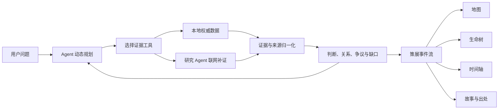

# 光锥之内 · Inside the Light Cone

**让 Agent 沿证据生长故事。**

“光锥之内”是一套全织域 Agent 系统：它可以围绕任何复杂对象，自主建立调查边界、生成问题树、编排数据源与工具、追踪事实和观点、识别冲突与空白，并把不断增长的证据组织成可验证、可交互、可继续推演的情报世界。数字人文策展是首个展示入口，人物、家族、族群、遗址、科学问题、技术路线、企业、产业链和公共事件都可以进入同一套调查协议。

## 项目缘起

历史研究中的证据分散在古基因组数据、考古发掘报告、正史与编年材料、地方志、作品集、善本书、可信回忆录、论文、机构数据库和博物馆目录中。传统检索界面常以文献列表结束，研究者仍需手工拼接人物、地点、年代、迁徙、关系与影响。

本项目把这些材料组织成可计算的证据网络。每条材料保留来源、时间精度、地点精度、证据层级和引用关系；Agent 根据用户当下的问题决定调查方向，并将证据转换为可交互的时空叙事。

## 展示方式

以苏轼为例，Agent 可以围绕迁徙、任职、贬谪、作品、思想与后世影响形成动态主线：

- 地图显示有来源支持的地点与真实位移，拖动时间轴即可观察一生轨迹；
- 生命树的枝条来自本轮调查计划，叶子对应关键事件与故事；
- 时间轴、地图、生命树和故事卡共享同一事件 ID，选择任一视图都会同步定位；
- 每片叶子可回到史传、方志、作品集、论文或数据库记录；
- 争议观点、证据缺口和后世影响可以沿独立分支继续生长。

换成建州女真、爱新觉罗家族、历史战役、考古遗址或古代人群，系统沿用同一套调查协议，由 Agent 重新规划主题枝、证据来源和叙事结构。

## Agent 如何工作

Agent 每轮根据已取得的证据决定下一步动作。计划、工具调用、判断更新、来源补证和策展节点都通过统一协议进入事件流。



它的自主性体现在五个环节：

1. 根据问题生成 4–8 条调查主线；
2. 依据证据状态选择本地检索、古基因组、考古、地名、文献或联网研究工具；
3. 将新证据与既有判断连接，更新支持、反驳、亲缘、同址、同时和派生关系；
4. 识别材料冲突、时间地点精度和证据空白；
5. 按当前问题生成策展节点与主题枝，同一批材料可以形成不同叙事。

前端只消费 Agent 生成的通用事件协议。任何人物、家族、族群或遗址都能进入相同链路，策展结果由问题与证据共同决定。

## 证据体系

系统已经接入 AADR v66.p1 古基因组公开数据制品，并建立文献、人物、遗址、时间和外部标识的本地索引。核心数据字段包括：

- 实体：人物、家族、族群、遗址、机构、作品与事件；
- 时间：起止年份、原始纪年文字与时间精度；
- 空间：历史地名、现代地名、经纬度与地点精度；
- 来源：史传、方志、作品集、善本、回忆录、论文、发掘报告、古基因组数据集、机构数据库与馆藏目录；
- 判断：事实、研究观点、争议状态与证据缺口；
- 关系：支持、反驳、亲缘、同址、同时、组成与派生。

地图采用矢量中国标准轮廓图，事件点、迁徙线与时间轴保持同步；只有证据明确支持位移时才生成路线。

## 全织域 Agent

“全织域”意味着 Agent 可以跨越资料形态、知识领域和任务阶段，把档案、论文、数据库、专利、法规、公告、财报、新闻、地理信息、图像与数值数据编织进同一张证据网络。用户只需提出目标，Agent 会在开放世界中持续完成实体发现、来源选择、交叉验证、时间排序、空间定位、关系推演、争议管理和叙事生成。调查过程中出现的新人物、新机构、新地点、新技术和新事件都能成为下一轮行动的入口，问题树会随证据实时生长。

这套能力可以服务于历史文化策展、科研前沿追踪、技术路线研判、产业链分析、企业与项目尽调、政策与区域研究、公共事件调查、知识发现和复杂决策支持。各领域共享统一的事件、实体、来源、判断和关系协议，同时保留各自的专业工具与证据标准。地图、时间轴、生命树和关系网络也会随对象切换为相应的情报界面。

药物靶点与 BD 尽职调查是全织域能力的一个展示案例。输入一个靶点后，Agent 可以规划并追踪：

- 靶点发现史、作用机制与关键实验；
- 专利谱系、公司归属、授权交易与资本事件；
- 临床项目、适应症、入组策略、生物标志物与监管节点；
- 项目失败及不同机构对失败机制的解释；
- 竞争格局、技术路线迁移与潜在合作机会。

这些结果可以继续投影为时间轴、机构关系树、交易地图和证据卡。历史人物的“生命树”在这一场景中转化为靶点、资产、公司、临床项目与专利共同生长的情报树；进入其他领域时，同一交互范式还可以生成技术演化树、产业依赖树、政策影响树或事件传播树。

## 技术架构

- 前端：React、Vite、原生 SVG；
- 后端：FastAPI、SSE 实时事件流；
- Agent：OpenAI-compatible 模型接口、主备 Provider、研究 Agent；
- 数据：SQLite 证据目录、AADR 数值制品、结构化策展来源包；
- 协议：计划、工具、证据、判断、关系、状态和策展事件统一建模。

## 启动演示

```bash
./scripts/run_demo.sh
```

浏览器打开 `http://127.0.0.1:5173/`。

推荐演示问题：

```text
苏轼一生迁徙、贬谪和作品如何相互影响？
```

模型配置字段见 `.env.example`，详细配置说明见 `docs/LLM_SETUP.md`。

## 后续计划

后续迭代将建设覆盖学术、历史、产业、企业、政策与公共信息的来源连接器，扩展多模态材料理解、跨库实体归一、时空推理、因果假设、协同审阅和多 Agent 并行调查。系统将进一步开放领域工具协议和策展投影协议，让团队能够为任意行业接入专业数据库、分析模型与可视化组件，逐步形成面向全织域知识发现与情报决策的 Agent 基础设施。
